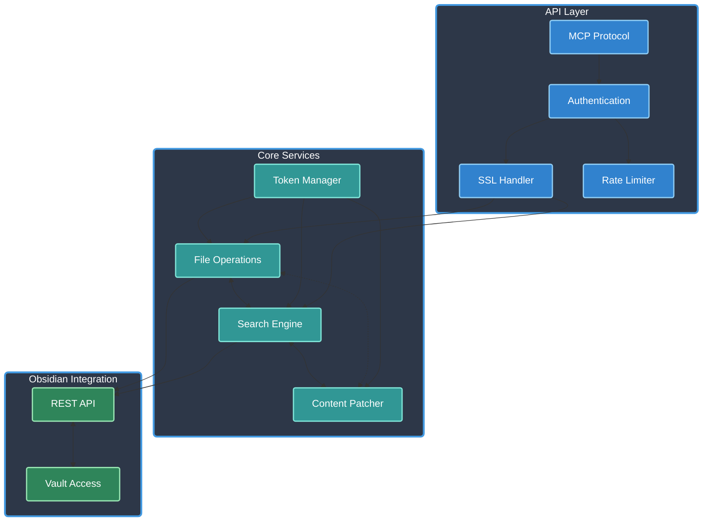

# Obsidian MCP Server

[](https://www.typescriptlang.org/)
[](https://modelcontextprotocol.io/)
[]()
[](https://opensource.org/licenses/Apache-2.0)
[]()

The Obsidian MCP Server implements the Model Context Protocol (MCP), providing a standardized interface for LLMs to interact with Obsidian vaults. Built with TypeScript and featuring secure API communication, efficient file operations, and comprehensive search capabilities, it enables AI assistants to seamlessly read, search, and modify Obsidian notes through a clean, flexible tool interface.

Note: This server requires the Local REST API plugin in Obsidian to be enabled. You can donwload and install the plugin from the Obsidian community plugins page.

## Table of Contents

- [Overview](#overview)
  - [Architecture & Components](#architecture--components)
- [Features](#features)
  - [File Operations](#file-operations)
  - [Search System](#search-system)
  - [Security & Communication](#security--communication)
  - [Token Management](#token-management)
- [Installation](#installation)
- [Configuration](#configuration)
- [Tools](#tools)
  - [File Management](#file-management)
  - [Search Operations](#search-operations)
  - [Content Modification](#content-modification)
- [Best Practices](#best-practices)
- [Contributing](#contributing)
- [License](#license)

## Overview

The Obsidian MCP Server enables standardized communication between LLMs and Obsidian through:

- **Clients**: Claude Desktop, IDEs, and other MCP-compatible clients
- **Server**: Tools and resources for Obsidian vault interaction
- **LLM Agents**: AI models that leverage the server's capabilities

Key capabilities:

- **File System Operations**: Intuitive path-based access to vault contents
- **Search Functionality**: Simple and complex search patterns with context
- **Content Management**: Append and patch operations with targeted modifications
- **Security Features**: API key authentication, rate limiting, and comprehensive validation
- **Token Management**: Automatic token counting and response truncation
- **Performance Focus**: Efficient file operations and search optimization

### Architecture & Components

Core system architecture:



Core Components:

- **API Layer**: MCP protocol implementation with authentication and rate limiting
- **Core Services**: File operations, search, content modification, and token management
- **Obsidian Integration**: Secure vault access through REST API
- **Security Layer**: API key validation, rate limiting, and SSL management

## Features

### File Operations

- **Hierarchical Access**: Path-based file and directory listing
- **Content Retrieval**: Efficient file content access
- **Modification Support**: Append and patch operations
- **Directory Management**: Recursive file listing
- **Path Validation**: Automatic path verification and traversal prevention

### Search System

- **Simple Search**: Text-based search across vault
- **Complex Queries**: JsonLogic-based advanced search
- **Context Control**: Configurable result context length
- **Result Scoring**: Relevance-based result ranking
- **Search Optimization**: Efficient query processing

### Security & Communication

- **API Authentication**: Secure key-based access
- **Rate Limiting**: Configurable request rate limits
- **Request Timeouts**: Automatic timeout handling
- **SSL Configuration**: Flexible SSL verification
- **Local Development**: Self-signed certificate support
- **Request Validation**: Input sanitization and path validation
- **Error Handling**: Comprehensive error management
- **Security Headers**: HSTS, XSS Protection, and other security headers
- **XSRF Protection**: Built-in XSRF token validation

### Token Management

- **Token Counting**: Automatic token counting using tiktoken
- **Response Limits**: 50k token limit for responses
- **Smart Truncation**: Preserves as much useful content as possible
- **User Feedback**: Clear truncation messages
- **Resource Cleanup**: Proper tokenizer cleanup
- **Monitoring**: Token count logging for analysis

## Installation

### Prerequisites

- Node.js (Latest LTS version recommended)
- Obsidian with Local REST API plugin
- API key from Local REST API plugin

### Setup

1. Clone the repository:
```bash
git clone git@github.com:cyanheads/obsidian-mcp-server.git
cd obsidian-mcp-server
npm install
npm run build
```

### Build System

The build process includes:

- TypeScript compilation
- Declaration file generation
- Permission management
- Development utilities

## Configuration

### MCP Client Settings

Add to your MCP client settings:

```json
{
  "mcpServers": {
    "obsidian": {
      "command": "node",
      "args": ["/path/to/obsidian-mcp-server/build/index.js"],
      "env": {
        // Required Configuration
        "OBSIDIAN_API_KEY": "your-api-key-here",

        // Optional Configuration
        "OBSIDIAN_VERIFY_SSL": "false",     // SSL verification, defaults to false
        "OBSIDIAN_HOST": "127.0.0.1",       // Obsidian host, defaults to 127.0.0.1
        "OBSIDIAN_PORT": "27124",           // Obsidian port, defaults to 27124
        "OBSIDIAN_PROTOCOL": "https",       // Protocol, defaults to https

        // Rate Limiting Configuration
        "RATE_LIMIT_WINDOW": "900000",      // Rate limit window in ms (default: 15 minutes)
        "RATE_LIMIT_MAX": "100",            // Max requests per window (default: 100)

        // Token Management Configuration
        "MAX_TOKENS": "50000",              // Maximum tokens per response (default: 50000)

        // Environment Configuration
        "NODE_ENV": "development"           // Optional, defaults to development
      }
    }
  }
}
```

### Security Configuration

The server provides comprehensive security features:

- **API Authentication**: Required for all operations
- **SSL Verification**: Optional for local development
- **Certificate Handling**: Special handling for localhost
- **Request Validation**: Input sanitization and validation
- **Path Validation**: Prevents directory traversal attacks
- **Security Headers**: Protection against common web vulnerabilities
- **XSRF Protection**: Prevention of cross-site request forgery

## Tools

The server provides three categories of tools:

### File Management

```typescript
// List Operations
obsidian_list_files_in_vault: {
  // Lists all files in vault root
  // No parameters required
}

obsidian_list_files_in_dir: {
  dirpath: string  // Directory path relative to vault root
}

// Content Operations
obsidian_get_file_contents: {
  filepath: string  // File path relative to vault root
}
```

### Search Operations

```typescript
// Simple Search
obsidian_simple_search: {
  query: string,           // Search text
  contextLength?: number   // Context size (default: 100)
}

// Advanced Search
obsidian_complex_search: {
  query: {                 // JsonLogic query object
    // Example: Match all markdown files
    "glob": ["*.md", {"var": "path"}]
  }
}
```

### Content Modification

```typescript
// Append Operations
obsidian_append_content: {
  filepath: string,  // Target file path
  content: string    // Content to append
}

// Patch Operations
obsidian_patch_content: {
  // Required parameters
  filepath: string,   // Target file path
  operation: "append" | "prepend" | "replace",
  targetType: "heading" | "block" | "frontmatter",
  target: string,     // Target identifier (heading path, block reference, or frontmatter field)
  content: string,    // Content to insert

  // Optional parameters
  targetDelimiter?: string,      // Delimiter for nested targets (default: '::')
  trimTargetWhitespace?: boolean, // Trim target whitespace (default: false)
  contentType?: "text/markdown" | "application/json" // Content type for structured data
}

// Example: Add row to table with block reference
obsidian_patch_content: {
  filepath: "data.md",
  operation: "append",
  targetType: "block",
  target: "table-ref-id",
  content: '["Chicago, IL", "16"]',
  contentType: "application/json"
}

// Example: Update nested heading with custom delimiter
obsidian_patch_content: {
  filepath: "notes.md",
  operation: "append",
  targetType: "heading",
  target: "Projects->Tasks->Active",
  targetDelimiter: "->",
  content: "- [ ] New task"
}
```

## Best Practices

### File Operations

- Use descriptive file paths
- Handle file operations atomically
- Validate content before modifications
- Implement proper error handling
- Monitor operation performance
- Prevent path traversal attacks

### Search Implementation

- Use specific search queries
- Optimize context length
- Handle large result sets
- Cache frequent searches
- Monitor search performance
- Consider token limits

### Error Prevention

- Validate inputs thoroughly
- Handle API errors gracefully
- Implement retry logic
- Monitor error patterns
- Maintain audit logs
- Check rate limits

### Token Management

- Monitor token usage patterns
- Handle truncation gracefully
- Optimize response content
- Clean up resources properly
- Log token metrics
- Consider content priority

## Contributing

1. Fork the repository
2. Create a feature branch
3. Commit your changes
4. Push to the branch
5. Create a Pull Request

For bugs and feature requests, please create an issue at [https://github.com/cyanheads/obsidian-mcp-server/issues](https://github.com/cyanheads/obsidian-mcp-server/issues).

## License

Apache License 2.0

---

<div align="center">
Built with the Model Context Protocol
</div>
